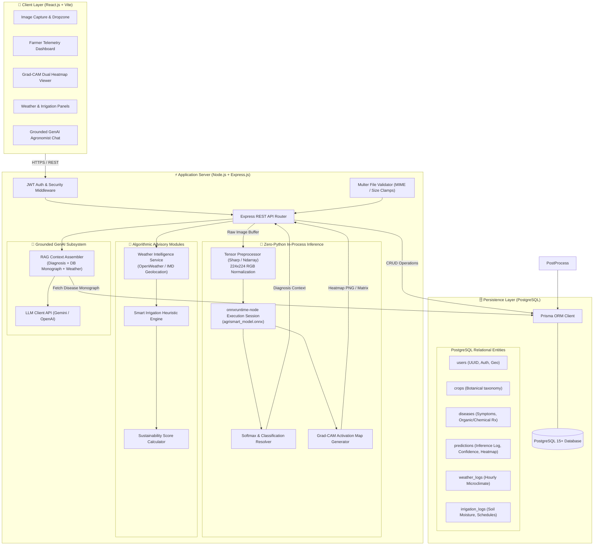
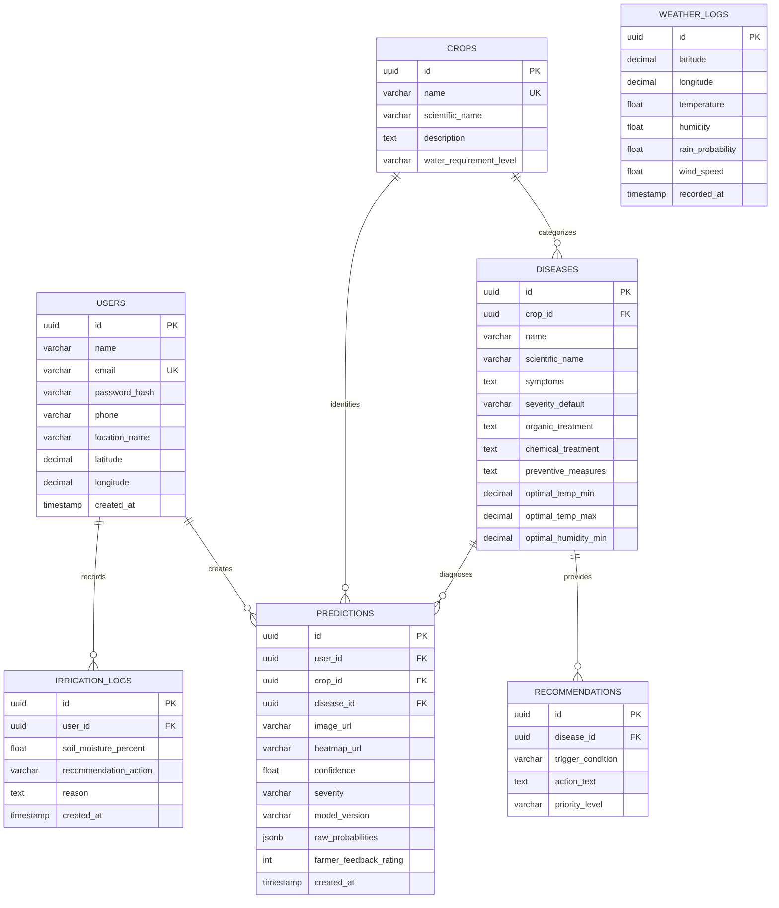

# 🏛️ AgriSmart AI — System Architecture Specification

> **SIH 2026 Technical Architecture Document**  
> **Primary Database:** PostgreSQL 15+ (via Prisma ORM)  
> **Execution Paradigm:** Single-Runtime Node.js + `onnxruntime-node` (Zero-Python Production Inference)

---

## 1. Architectural Overview & System Vision

AgriSmart AI is architected as an **ultra-lean, high-concurrency agricultural decision-support platform**. Unlike conventional prototypes that struggle with dual-server orchestration (Node.js + Python FastAPI), AgriSmart adopts a **Single-Runtime Node.js Architecture**:
- **Offline Stage (Python):** Deep learning models are trained, evaluated for real-world field robustness, and exported to Open Neural Network Exchange (**ONNX**) weights.
- **Production Stage (Node.js):** The live application executes exclusively in Node.js. Image preprocessing and neural network inference run in-process via C++ hardware bindings provided by **`onnxruntime-node`**.
- **Data Persistence (PostgreSQL):** All transactional entities, crop-disease monographs, spatial telemetry, prediction logs, and irrigation schedules persist in an ACID-compliant **PostgreSQL** relational database managed by **Prisma ORM**.

---

## 2. End-to-End System Architecture Diagram



---

## 3. Subsystem Breakdown & Technical Specifications

### 3.1 Client Layer (Frontend Architecture)
- **Framework:** React 18+ bootstrapped with **Vite** for fast hot-module replacement and optimized bundle sizes.
- **Styling & Aesthetics:** Modern, responsive dashboard built with custom CSS design tokens, dark/light theme support, glassmorphic metric cards, and mobile-first touch optimization.
- **State & Communication:**
  - **Axios HTTP Client** configured with request/response interceptors for automatic JWT Bearer token injection.
  - **Component Structure:**
    - `ImageUploader.jsx`: Drag-and-drop zone with client-side image preview and dimension validation.
    - `HeatmapViewer.jsx`: Side-by-side interactive comparison slider displaying original leaf photo vs. the generated Grad-CAM heatmap overlay.
    - `WeatherWidget.jsx`: Displays ambient temperature, humidity, rainfall probability, and a calculated pathogen outbreak risk gauge.
    - `IrrigationCard.jsx`: Displays automated water recommendations with actionable rationale.
    - `AssistantChat.jsx`: Chat interface supporting conversational inquiries in English and Hindi/Hinglish.

---

### 3.2 In-Process Machine Learning Pipeline (`onnxruntime-node`)

```
[Leaf Image Upload (JPEG/PNG)]
             │
             ▼
[Sharp / Canvas Image Processing]
  ├── Resize: 224 x 224 px
  ├── Colorspace: RGB 3-Channel
  └── Normalization: (Pixel / 255.0 - Mean) / Std
             │
             ▼
[Float32Array Tensor: Shape [1, 3, 224, 224]]
             │
             ▼
[onnxruntime-node Inference Session]
  ├── Loads 'agrismart_model.onnx' directly into C++ memory
  └── Evaluates forward pass (<50ms execution latency)
             │
      ┌──────┴───────────────────────────┐
      ▼                                  ▼
[Class Logits & Softmax]       [Convolutional Activation Weights]
      │                                  │
      ▼                                  ▼
[Crop & Disease Classification]  [Grad-CAM Heatmap Synthesis]
(e.g., Tomato - Early Blight, 94.2%)  (Lesion localization overlay)
```

#### Why Zero-Python Runtime is Superior:
1. **Single Memory Space:** Image buffers are processed directly in Node.js and passed to native C++ ONNX bindings without serializing over local loopback HTTP sockets.
2. **Resource Efficiency:** Avoids loading Python runtime overhead (PyTorch + Torchvision + CUDA dependencies), saving over 1 GB of idle RAM.
3. **Fault Isolation:** Eliminates cross-process connection drops, orphaned Python worker processes, and port conflicts during hackathon judging.

---

### 3.3 Database Architecture (PostgreSQL 15+)

The database is built on **PostgreSQL** to guarantee relational integrity, JSONB support for dynamic advisory configurations, and spatial query capability for regional telemetry.



#### Key PostgreSQL Performance Indexes:
- `CREATE INDEX idx_predictions_user_created ON predictions(user_id, created_at DESC);` (Fast retrieval of farmer scan history).
- `CREATE INDEX idx_diseases_crop ON diseases(crop_id);` (Instant crop-to-disease resolution).
- `CREATE INDEX idx_weather_geo ON weather_logs(latitude, longitude, recorded_at DESC);` (Rapid meteorological caching).

---

### 3.4 Advisory & Intelligence Modules

#### 1. Weather Intelligence Service
- Ingests geolocation parameters (`latitude`, `longitude`).
- Queries OpenWeatherMap / Indian Meteorological Department (IMD) REST APIs.
- Caches meteorological responses in PostgreSQL for 30 minutes to minimize API rate limit consumption.

#### 2. Pathogen Outbreak Risk Engine
Calculates outbreak probability $R_{\text{risk}} \in [0, 1]$:
$$R_{\text{risk}} = 0.45 \cdot \mathcal{H}_{\text{score}} + 0.35 \cdot \mathcal{T}_{\text{score}} + 0.20 \cdot \mathcal{P}_{\text{rain}}$$
Where:
- $\mathcal{H}_{\text{score}} = \min(1.0, \frac{\text{Current Humidity}}{\text{Disease Optimal Humidity Min}})$
- $\mathcal{T}_{\text{score}} = 1.0$ if temperature is within $[\text{Temp}_{\min}, \text{Temp}_{\max}]$; degrades quadratically outside this range.
- $\mathcal{P}_{\text{rain}} =$ Probability of rainfall in next 24 hours.

#### 3. Smart Irrigation Decision Engine
Generates an actionable irrigation verdict:
- **Delay Watering:** If $\text{Soil Moisture} \ge 35\%$ AND $\text{Rain Probability} \ge 60\%$.
- **Watering Urgently Needed:** If $\text{Soil Moisture} < 25\%$ AND $\text{Rain Probability} < 30\%$.
- **Maintain Regular Schedule:** If ambient and soil conditions are optimal.

---

### 3.5 Grounded GenAI Assistant (RAG Pipeline)

To protect farmers from hallucinations and hazardous agrochemical advice, the GenAI assistant enforces **Database & Context Grounding**:

```
[Farmer Natural Language Prompt]
              │
              ▼
[Node.js Context Assembler]
  ├── 1. Current Diagnostic Result: Crop, Disease, Confidence, Severity
  ├── 2. Verified PostgreSQL Monograph: Organic & Chemical Treatments, Prevention
  ├── 3. Live Weather Telemetry: Temperature, Humidity, Rain Forecast
  └── 4. Agricultural Safety Guardrails: No unapproved chemicals, warn on rain
              │
              ▼
[Formatted Prompt Envelope] ──► [LLM API (Gemini / OpenAI / Groq)]
                                              │
                                              ▼
                             [Safe, Contextual, Multilingual Advisory]
```

---

## 4. Network & Data Flow Sequence

```mermaid
sequenceDiagram
    autonumber
    actor Farmer as 🧑‍🌾 Farmer (Client UI)
    participant NodeAPI as ⚡ Node.js Backend
    participant ONNX as 🧠 onnxruntime-node
    participant PG as 🗄️ PostgreSQL DB
    participant WeatherAPI as 🌦️ Weather API
    participant LLM as 🤖 GenAI API

    Farmer->>NodeAPI: POST /api/predictions (leaf.jpg + geolocation)
    NodeAPI->>NodeAPI: Multer validation & Sharp tensor preprocessing
    NodeAPI->>ONNX: Run InferenceSession (Tensor [1, 3, 224, 224])
    ONNX-->>NodeAPI: Logits + Activation Map
    NodeAPI->>NodeAPI: Softmax (Class: Early Blight, Conf: 94.2%) + Grad-CAM overlay
    
    NodeAPI->>PG: Query Disease Monograph (symptoms, treatments)
    PG-->>NodeAPI: Disease Details & Recommended Protocols
    
    NodeAPI->>WeatherAPI: Fetch Current & 24h Weather (lat, lon)
    WeatherAPI-->>NodeAPI: Temp: 24°C, Humidity: 86%, Rain Prob: 75%
    
    NodeAPI->>NodeAPI: Compute Fungal Risk (HIGH) & Irrigation Advice (DELAY)
    NodeAPI->>PG: INSERT into predictions & weather_logs
    NodeAPI-->>Farmer: Return Unified Diagnosis, Heatmap, Risk & Advisory JSON

    opt Farmer Asks Question to AI
        Farmer->>NodeAPI: POST /api/assistant/chat ("Can I spray medicine now?")
        NodeAPI->>NodeAPI: Assemble Grounded Context (Early Blight + Rain Expected)
        NodeAPI->>LLM: Dispatch System Prompt + Grounded Variables
        LLM-->>NodeAPI: "Do not spray today; 75% rain probability will wash it away..."
        NodeAPI-->>Farmer: Deliver Multilingual Grounded Answer
    end
```

---

## 5. Security, Resilience & Scalability Policies

1. **Authentication & Authorization:**
   - Stateless JWT tokens signed with HMAC-SHA256.
   - Passwords salted and hashed with bcrypt (12 rounds).
2. **File Ingestion Protection:**
   - Whitelist file types: `image/jpeg`, `image/png`, `image/webp`.
   - File size ceiling: **10 MB**.
   - Upload buffer sanitized with UUIDv4 naming before processing to prevent directory traversal.
3. **Database Security (PostgreSQL):**
   - All transactions executed through Prisma ORM using strictly parameterized queries to eliminate SQL injection.
   - Connection pooling enabled (`connection_limit = 10`) for optimal throughput.
4. **Resilience & Fallbacks:**
   - If the Weather API fails or times out, the system defaults to seasonal averages with a non-blocking UI alert.
   - If image confidence is below $50\%$, the system displays an **Ambiguous Foliage Warning** advising the farmer to retake the picture closer to the leaf surface in better lighting.
