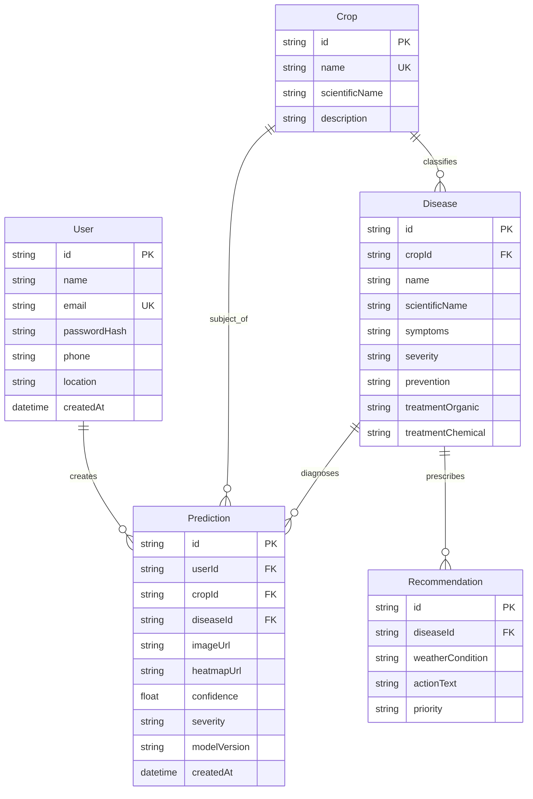

# 🧠 AgriSmart AI — System Context & Architecture Guide

> **Document Purpose:**  
> This document provides comprehensive context, architectural rationale, machine learning strategies, domain background, and operational mechanics for **AgriSmart AI** (Smart India Hackathon 2026). It serves as the primary technical briefing for developers, AI assistants, system integrators, and hackathon judges.

---

## 1. Domain Background & Problem Context

### 1.1 The Agricultural Reality in India
Agriculture is the backbone of the Indian economy, employing nearly 45% of the national workforce and contributing significantly to GDP. However, smallholder and marginal farmers face systemic vulnerabilities:
- **Catastrophic Crop Loss:** Fungal, bacterial, and viral foliar diseases cause between 20% to 40% of global crop losses annually. In high-density crops like tomatoes, potatoes, and chilies, a late blight infestation can wipe out an entire yield within 48 to 72 hours under humid conditions.
- **Scarcity of Agricultural Extension Officers:** The ratio of agricultural extension workers to operational farm holdings in India is less than 1:1,000, meaning farmers cannot receive timely, expert physical inspections of diseased leaves.
- **Over-Application of Toxic Agrochemicals:** When faced with unidentified leaf spots or wilting, farmers frequently resort to blanket spraying of broad-spectrum chemical fungicides and pesticides. This causes soil degradation, chemical run-off into local water tables, pesticide resistance, and severe financial distress due to high input costs.
- **Water Mismanagement:** Over 80% of India's freshwater is consumed by agriculture. Uninformed flood irrigation often coincides with forecasted rainfall, causing root rot, favorable fungal microclimates, and massive water wastage.

### 1.2 The Lab vs. Field Domain Gap (The Core ML Bottleneck)
Numerous academic papers and prototype applications claim $>98\%$ crop disease classification accuracy on open datasets such as **PlantVillage**. However, when deployed to a farmer in a field in Maharashtra or Uttar Pradesh, these models fail dramatically (often dropping to $<40\%$ real-world accuracy).

| Attribute | Laboratory Dataset (e.g., PlantVillage) | Real-World Agricultural Field (e.g., PlantDoc) |
|---|---|---|
| **Background** | Clean, monochrome, flat gray/black/white paper | Complex background: soil, weeds, farmer's fingers, trellis wires, ground shadows |
| **Lighting** | Diffused, uniform studio illumination | Harsh direct sunlight, high-contrast shadows, dappled canopy light |
| **Specimen** | Single, perfectly plucked leaf laid flat | Multiple overlapping leaves, curled margins, insect bites, dirt splatter |
| **Camera Sensor** | High-resolution standardized DSLR/scanner | Budget smartphone cameras, lens flare, motion/wind blur, low dynamic range |

**AgriSmart AI's Mandate:** Bridge this critical divide through robust multi-dataset training, domain-invariant data augmentation, explainable visual verification (Grad-CAM), and single-runtime edge inference.

---

## 2. Updated Architectural Philosophy: The Zero-Python Production Paradigm

```
[Traditional Dual-Microservice Pattern (Deprecated)]
React Client  ──>  Node.js API  ──(HTTP / Network Hop)──>  Python FastAPI  ──>  PyTorch / TF (Heavy RAM, 2 Runteimes)

[AgriSmart AI Updated Single-Runtime Architecture]
React Client  ──>  Node.js + Express  ──(In-Process C++ Bindings)──>  onnxruntime-node  (Ultra-Fast, Single Runtime)
```

### 2.1 The Architectural Shift
In early architecture drafts, a conventional dual-microservice setup was proposed: Node.js handled user management and routing, while a separate Python FastAPI server was spun up to run PyTorch inference.

Following a rigorous performance and deployment audit for SIH 2026, **the architecture was formally upgraded to an exported ONNX single-runtime system**:
1. **Offline Training (Python):** Python (PyTorch/TensorFlow) is utilized purely offline for heavy model training, hyperparameter tuning, and evaluation.
2. **ONNX Export:** The final validated model is frozen and exported to **Open Neural Network Exchange (ONNX)** format (`.onnx`).
3. **Live Production Runtime (Node.js):** The live production application runs exclusively in **Node.js**, executing inference via `onnxruntime-node`.

### 2.2 Why This Decision Was Made
- **Elimination of Inter-Process Network Latency:** Eliminates the internal HTTP hop between Node.js and FastAPI. The preprocessed image buffer is passed directly to the C++ inference engine in memory.
- **Drastic Reduction in Memory Footprint:** Python runtimes with PyTorch, CUDA libraries, and FastAPI consume between 800MB to 1.8GB of idle memory. `onnxruntime-node` runs natively with a minimal footprint (~60MB–120MB), allowing AgriSmart AI to run on free-tier cloud instances (Render, Railway, Fly.io, AWS EC2 t3.micro) or affordable edge hardware (Raspberry Pi 4/5).
- **Single Deployment Artifact:** Deployment operations require only one runtime (`Node.js 18+`), eliminating multi-container orchestration bugs during live hackathon demos.
- **Cross-Platform Portability:** ONNX is an open standard supported by Microsoft, Meta, and AMD. The exact same `.onnx` weight file can run on Node.js, on mobile devices (React Native / ONNX Runtime Mobile), or in-browser via WebAssembly.

---

## 3. Machine Learning & Computer Vision Deep Dive

### 3.1 Dataset Synergy Strategy
AgriSmart AI avoids single-source training bias by combining:
1. **PlantVillage (Base Feature Extraction):** 54,303 lab-curated images covering 14 crop species and 38 disease/healthy classes. Provides dense morphological feature maps of leaf pathogens.
2. **PlantDoc (Field Domain Adaptation):** 2,598 in-situ field images containing leaves in natural farm settings with complex foliage and background clutter.
3. **Targeted Field Augmentations (Albumentations):**
   - *Spatial:* Random Affine, Perspective Warping (simulating angled smartphone shots), Elastic Transform (leaf curvature), Random Cropping.
   - *Photometric:* Random Sun Flare, Shadow Simulation, Color Jitter, CLAHE (adaptive histogram equalization).
   - *Sensor Noise:* Gaussian Blur, Motion Blur (wind movement), JPEG Quality Degradation (low-bandwidth image uploads).

### 3.2 Model Backbone Selection
- **EfficientNet-B0 (Primary Backbone):** Balances parameter efficiency (5.3M parameters) with state-of-the-art feature extraction via compound scaling (depth, width, resolution).
- **MobileNetV3-Small (Edge Alternative):** Ultra-lightweight candidate evaluated for real-time mobile and edge execution.

### 3.3 Explainable AI: Grad-CAM (Gradient-Weighted Class Activation Mapping)
A common barrier to AI adoption in rural farming is skepticism: *"Why should I trust a screen telling me to burn my tomato crop?"*

AgriSmart AI solves this through **Explainable AI (Grad-CAM)**:
1. **Mathematical Mechanism:**
   Grad-CAM calculates the gradient of the winning class score $y^c$ with respect to the feature activation map $A^k$ of the final convolutional layer:
   $$\alpha_k^c = \frac{1}{Z} \sum_{i} \sum_{j} \frac{\partial y^c}{\partial A_{i,j}^k}$$
2. **Heatmap Generation:**
   A weighted combination of forward activation maps followed by a ReLU operation isolates features that positively correlate with the disease:
   $$L_{\text{Grad-CAM}}^c = \text{ReLU}\left( \sum_k \alpha_k^c A^k \right)$$
3. **Farmer Insight:**
   The normalized heatmap is overlaid directly onto the uploaded leaf photo. If the model predicts *Tomato Early Blight*, the heatmap highlights the concentric rings (target-like lesions) on the leaf surface. If the heatmap illuminates the background or human fingers, the system issues an **Uncertain Quality Warning** prompting the farmer to retake the photo.

---

## 4. Grounded GenAI Assistant Architecture

```
Farmer Query ("My tomato leaves have brown spots and it's raining, what should I do?")
       │
       ▼
Node.js Assistant Controller
       │
       ├─► 1. Query Active User & Diagnosis Context (Crop: Tomato, Disease: Early Blight, Confidence: 94%)
       ├─► 2. Query Disease Monograph (Organic Treatments: Neem oil, Trichoderma; Chemical: Mancozeb)
       ├─► 3. Query Local Weather (Humidity: 88%, Rain: Expected in 6h)
       │
       ▼
Context Assembler & Strict Grounding Prompt
       │
       ▼
LLM API (Gemini / OpenAI / Groq)
       │
       ▼
Farmer Receives Grounded, Actionable, Multilingual Advisory
("Do NOT apply spray right now because rainfall within 6 hours will wash it away. Prune affected bottom leaves...")
```

### 4.1 The Hallucination Problem in Agriculture
Generic LLMs are notorious for fabricating agricultural chemicals, recommending hazardous dosage concentrations, or suggesting remedies unavailable in rural Indian markets.

### 4.2 The AgriSmart Grounding Solution
The Node.js GenAI service acts as a strict **Retrieval-Augmented Context Orchestrator**:
- **Structured System Prompt:** The LLM is supplied with:
  1. The verified diagnosis from the ONNX classification engine.
  2. The curated database monograph (symptoms, verified biological/chemical treatments approved by ICAR/CIBRC).
  3. Real-time meteorological telemetry from OpenWeather / IMD.
- **Strict Guardrails:** The prompt contains explicit negative constraints:
  - *"Never recommend banned agrochemicals."*
  - *"If rain is forecasted within 12 hours, explicitly warn against applying foliar sprays."*
  - *"Always prioritize organic/biological controls before synthetic chemicals."*
  - *"Support vernacular transliteration and Indian regional phrasing (e.g., Hinglish)."*

---

## 5. Algorithmic Engines & Mathematical Formulas

### 5.1 Weather-Based Disease Risk Index ($R_{\text{disease}}$)
Fungal spores thrive under specific microclimates. AgriSmart calculates dynamic vulnerability:
$$R_{\text{pathogen}} = (w_1 \cdot H_{\text{norm}}) + (w_2 \cdot T_{\text{optimal}}) + (w_3 \cdot P_{\text{rain}})$$
Where:
- $H_{\text{norm}} = \begin{cases} 1.0 & \text{if Humidity } \ge 80\% \\ \frac{\text{Humidity}}{80} & \text{otherwise} \end{cases}$
- $T_{\text{optimal}} = \exp\left(-\frac{(T - T_{\text{pathogen\_opt}})^2}{2\sigma^2}\right)$ (Gaussian curve centered around $24^\circ\text{C}$ for blights)
- $P_{\text{rain}} =$ Probability of precipitation in next 24 hours ($0.0 \to 1.0$).
- If $R_{\text{pathogen}} > 0.75$, the UI issues a **High Outbreak Alert**.

### 5.2 Smart Irrigation Decision Heuristic
$$I_{\text{decision}} = \begin{cases}
\text{"Delay Irrigation (Rain Predicted)"} & \text{if } P_{\text{rain}} > 0.60 \text{ and } M_{\text{soil}} \ge 35\% \\
\text{"Irrigation Urgently Needed"} & \text{if } M_{\text{soil}} < 25\% \text{ and } P_{\text{rain}} < 0.30 \\
\text{"Standard Regimen"} & \text{otherwise}
\end{cases}$$
*(Where $M_{\text{soil}}$ is soil moisture percentage from sensor or manual input).*

### 5.3 Sustainability Index (0 - 100)
Measures the ecological efficiency of the farm operation:
$$\text{Sustainability Score} = \sum_{i=1}^4 w_i \cdot S_i$$
1. **Water Conservation ($w_1 = 0.35$):** Adherence to weather-informed irrigation scheduling vs. indiscriminate flood watering.
2. **Eco-friendly Treatment ($w_2 = 0.30$):** Selection of bio-fungicides (e.g., *Trichoderma viride*, neem extracts) over broad-spectrum copper oxychloride.
3. **Preventive Sanitation ($w_3 = 0.20$):** Physical removal and deep-burial of diseased foliage rather than leaving infectious residue.
4. **Soil Health Monitoring ($w_4 = 0.15$):** Maintenance of optimal organic matter and moisture retention.

---

## 6. Complete Data Models & Entity Relationships

The system relies on an ACID-compliant relational SQL schema managed via **Prisma ORM**:



---

## 7. Security & Production Standards

1. **Authentication & Identity:**
   - Passwords hashed using **bcrypt** with a salt round factor of 12.
   - Stateless session management using cryptographic **JWT** (JSON Web Tokens) with 7-day expiration and Bearer token headers.
2. **File Ingestion Sanitization:**
   - Multer middleware enforces strict memory buffers and disk streaming with whitelist validation: only `image/jpeg`, `image/png`, and `image/webp`.
   - Maximum upload cap: **10 MB** to prevent denial-of-service memory exhaustion.
   - Filenames sanitized with cryptographically secure UUIDv4 hashes to prevent path traversal exploits (`../../etc/passwd`).
3. **SQL Injection Prevention:**
   - Parameterized queries enforced across all database transactions via Prisma ORM client.
4. **Environment Isolation:**
   - Zero production credentials stored in code repositories. Managed strictly through `.env` files with automated `.gitignore` audits.

---

## 8. Summary Checklist for Developers

When contributing code to AgriSmart AI:
- [x] **Never add a runtime dependency on Python for the live backend.** All inference must pass through `onnxruntime-node`.
- [x] **Keep controllers thin and services thick.** All business logic, weather API parsers, and irrigation math belong in `/src/services/`.
- [x] **Ground all LLM outputs.** Never invoke the LLM API without passing the active prediction object and localized weather parameters in the prompt envelope.
- [x] **Preserve mobile-first responsiveness in the frontend.** Farmers predominantly access the platform via budget Android smartphones.
